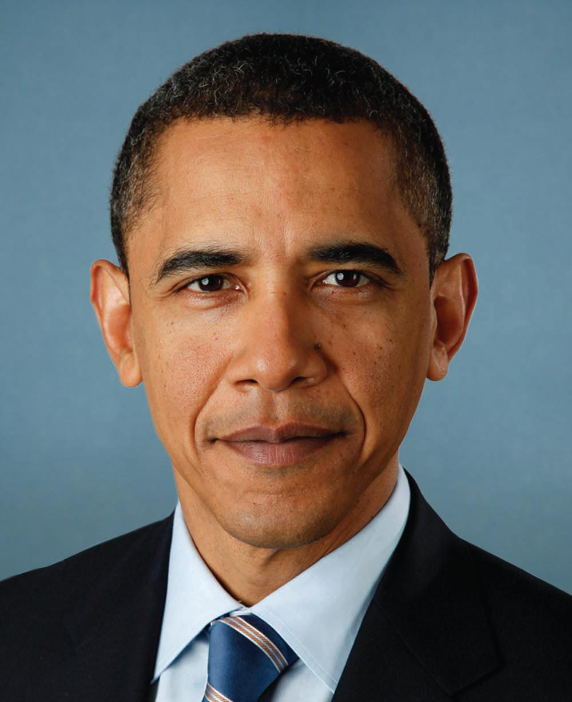

# Sketchify

A simple sketching software to convert an image to a realistic sketch!

Installation
------------
    pip install sketchify

#### Installation notes
sketchify depends on `opencv-contrib-python`.

## Usage

    from sketchify import sketch
    import cv2
    img = sketch.normalsketch(‘path/to/image.extension’)
    cv2.imsave(‘path.png’, img)

## Examples
Go to tests/test_images for more examples.

Obama Original|Obama Sketchified
:-------------------------------------------------------:|:--------------------------------------------------------------:
 |  

Colloseum Original|Colloseum Sketchified
:-----------------------------------------------------------:|:------------------------------------------------------------------:
| 