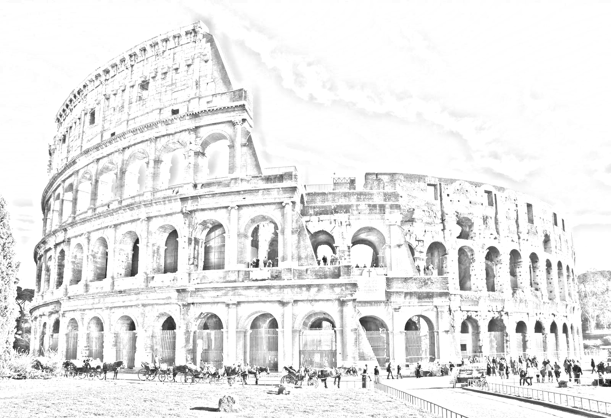

# Sketchify

A simple sketching software to convert an image to a realistic sketch!

Installation
------------
    pip install sketchify

#### Installation notes
sketchify depends on `opencv-contrib-python`.

## Usage

    from sketchify import sketch
    img = sketch.normalsketch(‘path/to/image.extension’, 'path/to/save/image', 'saveimagename')

## Examples
Go to tests/test_images for more examples.

Obama Original|Obama Sketchified
:-------------------------------------------------------:|:--------------------------------------------------------------:
 |  

Colloseum Original|Colloseum Sketchified
:-----------------------------------------------------------:|:------------------------------------------------------------------:
| 

## Article
https://medium.com/analytics-vidhya/image-to-pencil-sketch-in-just-2-lines-of-code-292de57be483